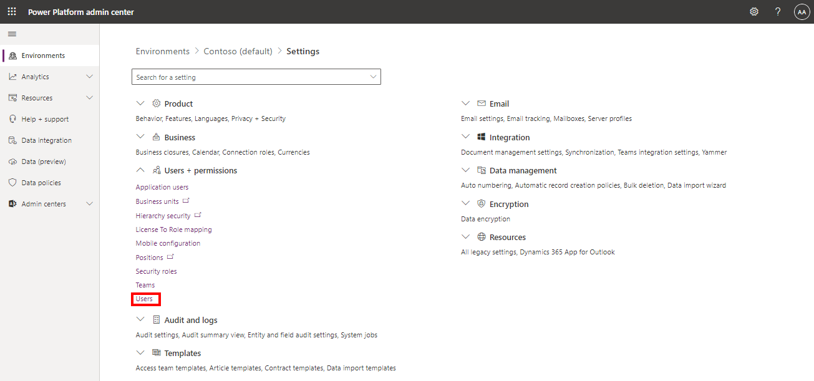
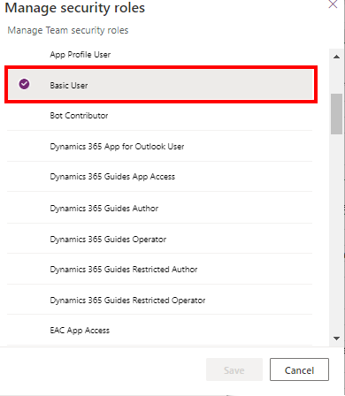
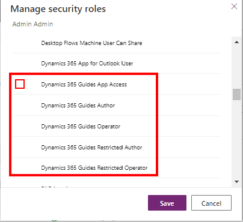

# Assign an Author or Operator role to an individual user in Dynamics 365 Guides

If you're a Microsoft Dynamics 365 Guides admin, you can assign an Author or Operator role to users to limit what they can do in the apps. The Restricted Author and 
Restricted Operator roles provide an extra layer of control. [Learn about the privileges provided by each role](admin-role-types.md).

> [!NOTE]
> You can also assign user roles in bulk by using [Azure Active Directory groups](admin-assign-role-groups.md).

## Prerequisites

To assign user roles:

- You must have an active Dynamics 365 Guides license. For more information, see [Buy a subscription or sign up a free trial](setup-step-one.md).

- The latest Dynamics 365 Guides solution must be installed. For more information, see [Update to the latest solution](upgrade.md).

- You must have access to the Power Platform admin center and have full admin privileges.

## Assign roles to a user
> [!NOTE]
> Users can take up to one hour to appear in the Dynamics 365 admin center after the licenses are added in the Microsoft 365 admin center.

1. Open the [Power Platform admin center](https://admin.powerplatform.microsoft.com/environments), in the **Environments** page, select the Guides solution, select the **More environment actions** (ellipsis **...**) button, and then select **Settings**.

    

2. In the **Settings** page, select **Users**.

    

3. Select **Add user** . Enter user's name in the panel to the right. Select **Add**

    

4. Select user and select **Manage security roles**

    

5. Under **Manage security roles**, make sure that the **Basic User** check box is selected.

    

    
6. Select the check box(es) for the appropriate role(s) for the selected user(s), and then select **Save**.

    

    [Learn about the different Author and Operator roles](admin-role-types.md).

    > [!NOTE
    > If you want the user to have admin privileges, select the **System Administrator** check box.

## Troubleshooting

If users don't appear in the [Power Platform admin center](https://admin.powerplatform.microsoft.com/environments), select **Add user**. In the **Add user** dialog box, enter the account details, and then select **Add**. Users added to the instance should appear in the user list within a few minutes.

## See also

[Add additional user accounts to Dynamics 365 Guides](add-users.md) 
[Learn about the Author and Operator roles](admin-role-types.md) 
[Assign roles in bulk through Azure AD groups](admin-assign-role-groups.md)

[!INCLUDE[footer-include](../includes/footer-banner.md)]
