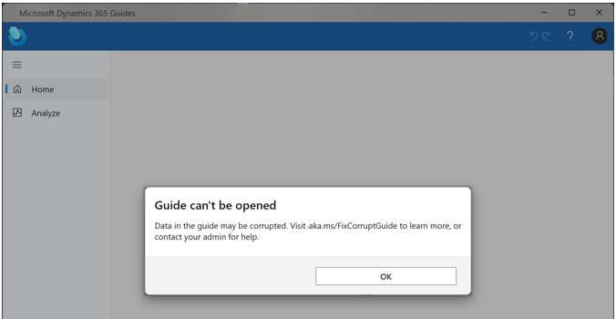
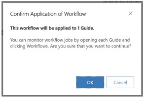

# Fix a corrupted guide in Dynamics 365 Guides

In very rare cases, you may find that a guide has become corrupted. This is most commonly associated with guides that were [shared with authors](admin-share-guide.md) in the time period from September 2021 to December 2021. When sharing a guide with an author, you must select the **Append to** privilege. Otherwise, the author can't save any steps that they add to a guide. For guides shared with an author between September 2021 and December 2021, however, due to a bug in Dynamics 365 Guides, the **Append to** privilege could not be set. If an author added one or more steps to a shared guide, and then saved the guide, the guide would become corrupted. If you open a corrupted guide in the PC app, you'll see the following message. 

A guide can also become corrupted if you delete a step [from the model-driven app](open-model-driven-app.md) (instead of from the PC app). 

## Run a flow to fix a corrupted guide

You can fix a corrupted guide by running a flow in the model-driven app. 

1. [Open the model-driven app](open-model-driven-app.md), and then open the corrupted guide. 

2. In the model driven app, on the **Flow** menu, select **Repair corrupted guide**.

    

    You'll see the following message. Select **OK**.
    
    
    
3. Wait a few minutes for the flow to complete.

## Make fixes in the PC app

The model-driven app flow adds steps in the correct places in the PC app for any steps that an author added in a shared guide for the situation described above. The other guide steps might appear in random positions, however, after running the flow. For example, if your guide has three steps, and the issue is with step 2, the steps in the PC app might look like this. 

