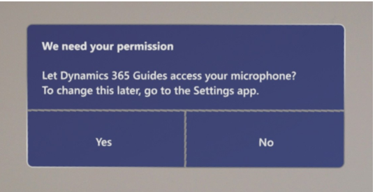

# HoloLens permissions required to use version 7.0 of Dynamics 365 Guides

Version 7.0 of Dynamics 365 Guides [introduced a new main menu and the ability to make calls from HoloLens](new.md). To use these new features in the HoloLens app, you must provide permission to use HoloLens eye tracking, the HoloLens camera, and the HoloLens microphone. 

When you open the HoloLens app for the first time in Dynamics 365 Guides version 7.0, you're prompted to provide these permissions (see screenshots below). If you don't provide one or more permissions, you won't be able to use Dynamics 365 Guides version 7.0. If you try to use the HoloLens app, a dialog box will appear and prompt you to turn on each setting. Alternatively, you can turn on each permission by following the steps described in this article.

## Why eye-tracking permission is required 

Eye tracking is required to use the main menu and to create a great experience. Eye tracking lets HoloLens know what you’re looking at and helps validate 
your intentions. 

Eye tracking has been designed with user privacy in mind. Microsoft doesn’t store any biometric or other identifiable information. 

### Give permission to use eye tracking

1. Go to **Settings** > **Privacy**, and then on the left side of the screen under **App permissions**, select **Eye tracker**. 

2. On the right side of the screen, under **Allow apps to access your eye tracker**, move the slider to **On**. 

3. On the right side of the screen, under **Choose which apps can access your eye tracker**, turn the individual settings for Dynamics 365 Guides to **On**. 

[Learn more about Windows 10 eye tracking and privacy](https://support.microsoft.com/en-us/windows/windows-10-eye-tracking-and-privacy-62623324-36cf-04a3-6992-8f329081f20b)

## Why camera permission is required 

The camera is required to make video calls, to understand the space around you, and more. 

### Give permission to use the camera 

1. Go to **Settings** > **Privacy**, and then on the left side of the screen under **App permissions**, select **Camera**. 

2. On the right side of the screen, under **Allow apps to access your camera**, move the slider to **On**.  

3. On the right side of the screen, under **Choose which apps can access your camera**, turn the individual settings for Dynamics 365 Guides to **On**. 

[Learn more about Windows camera, microphone, and privacy](https://support.microsoft.com/en-us/windows/windows-camera-microphone-and-privacy-a83257bc-e990-d54a-d212-b5e41beba857#ID0EBD=Windows_10)

## Why microphone permission is required 

The microphone is required to make voice calls and to use voice commands.  

 

### Give permission to use the microphone

1. Go to **Settings** > **Privacy**, and then on the left side of the screen under **App permissions**, select **Microphone**. 

2. On the right side of the screen, under **Allow apps to access your microphone**, move the slider to **On**. 

3. On the right side of the screen, under **Choose which apps can access your microphone**, turn the individual settings for Dynamics 365 Guides to **On**. 

[Learn more about Windows camera, microphone, and privacy](https://support.microsoft.com/en-us/windows/windows-camera-microphone-and-privacy-a83257bc-e990-d54a-d212-b5e41beba857#ID0EBD=Windows_10)

## See also

[Frequently asked questions about Dynamics 365 Guides](faq.md)
