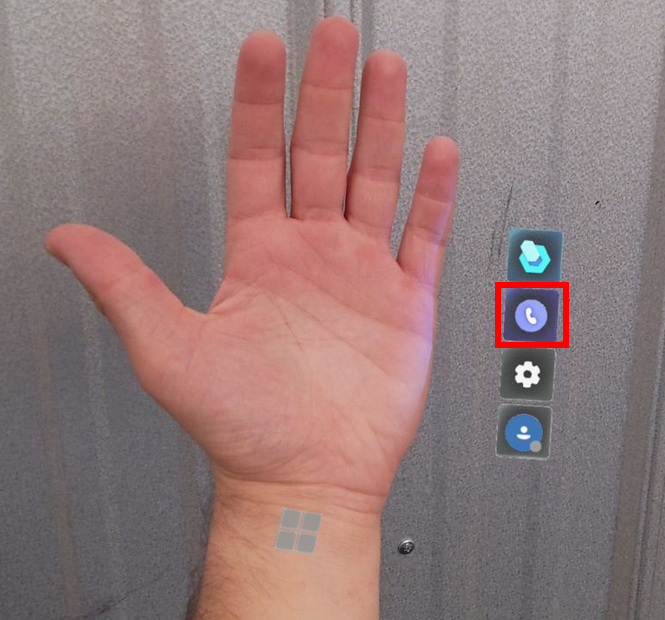
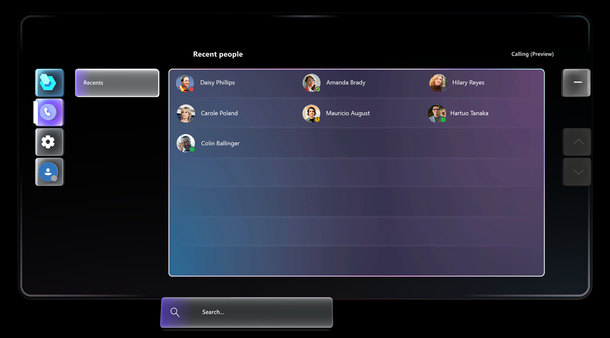
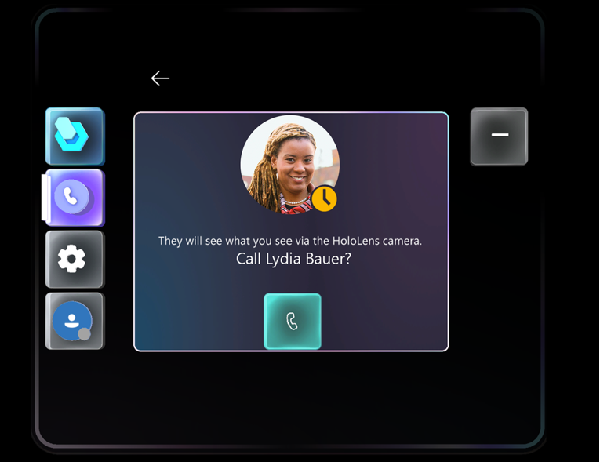
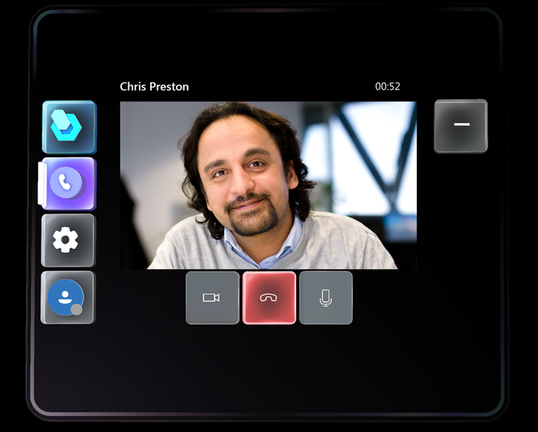

# Make a call (Preview) in the Dynamics 365 Guides HoloLens app

> [!IMPORTANT]
> Some or all of the functionality noted in this article is available as part of a preview release. The content and the functionality are subject to change. 

If you're using Microsoft Dynamics 365 Guides version 7.0 or later, you can make a call to a remote collaborator directly from Dynamics 365 Guides. This gives you the ability to work hands-free with a guide as you share what you see on your HoloLens with the remote collaborator. The remote collaborator answers the call using Microsoft Teams (desktop or mobile) and can see everything that you see on your HoloLens. For example, consider the following scenarios that calling enables:

- **Live guide demos**. Guide a new hire through their job process. 

- **Inspections**. Get approval from a remote inspector for a particular task.

- **Collaborative authoring**. Call an expert to discuss creating steps in 3D in real time.

- **Support calls and collaboration**. Share perspective and troubleshoot issues.

You can start a call after you open a guide, open a guide after placing a call, or do both simultaneously. You can also make a call or work on a guide independently.

> [!NOTE]
> To make a call from Dynamics 365 to a remote collaborator on Microsoft Teams, you must have a Microsoft Teams license. [Learn more about device and licensing requirements](requirements.md). 

## Limitations

- Only outgoing phone calls from the HoloLens user are supported at this time. The expert on Teams desktop can't call the HoloLens user.

- Only one-to-one calling is supported at this time. The Teams desktop user can add additional participants to the call, but only the video stream of the original Teams desktop user is shared with the HoloLens user.

## Make a call

The [Main menu](main-menu.md) makes it easy to start a call activity at any time while keeping holographic clutter to a minimum. 

1. Look at the palm of your hand to open the Main menu, and then select the **Call activity** button.

    
    
2. In the **Recent people** screen, select a contact. If you don't see the contact you're looking for, select the **Search** button at the bottom of the screen. 

    
    
3. Select the **Call** button for the contact. To go back to the **Recent people** screen, select the **Back** button. 

    

    While you're on the call, you can use the call controls below the **Active call** window to turn your video feed off or on, to mute or unmute yourself, or to end the call. By default, your video stream is on and your HoloLens is not muted.

     
    
## Reopen the Call activity window

The **Call activity** window doesn't follow you around in your environment like the instruction card, but you can easily bring it up at any time by looking at your palm to open the Main menu. [Learn more about the Main menu in Dynamics 365 Guides version 7.0](main-menu.md).
