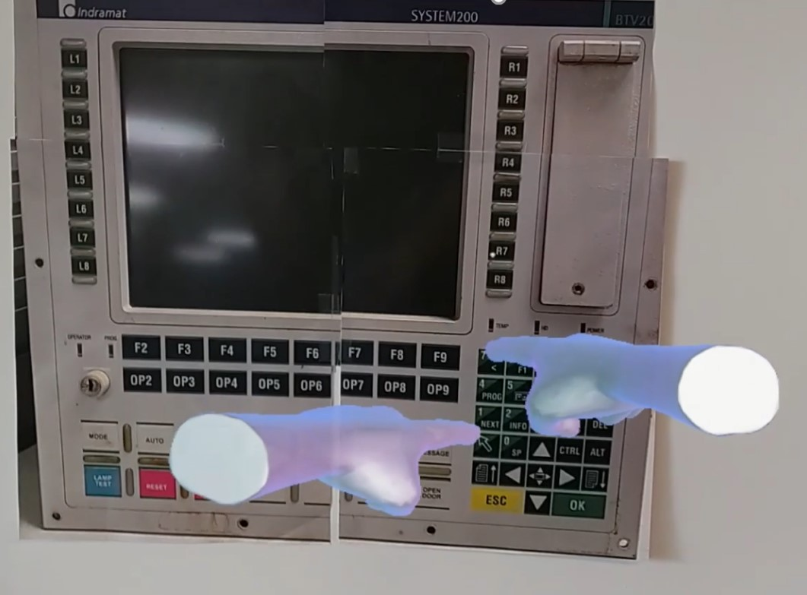
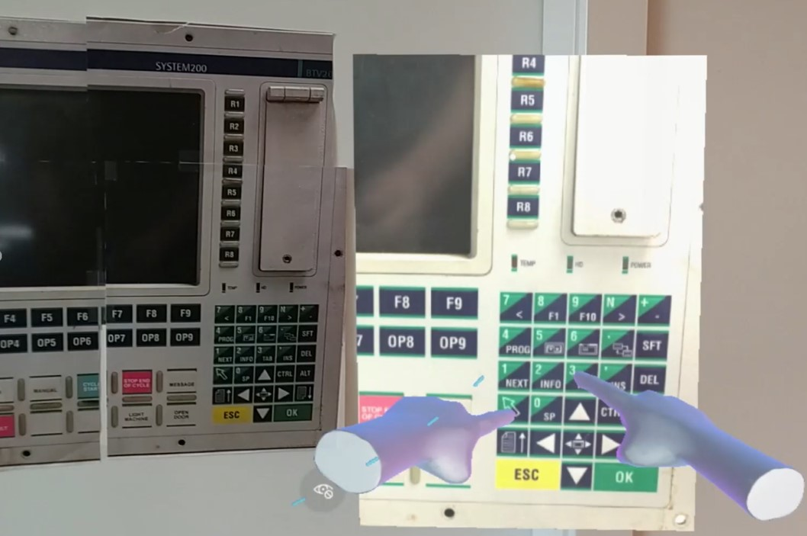
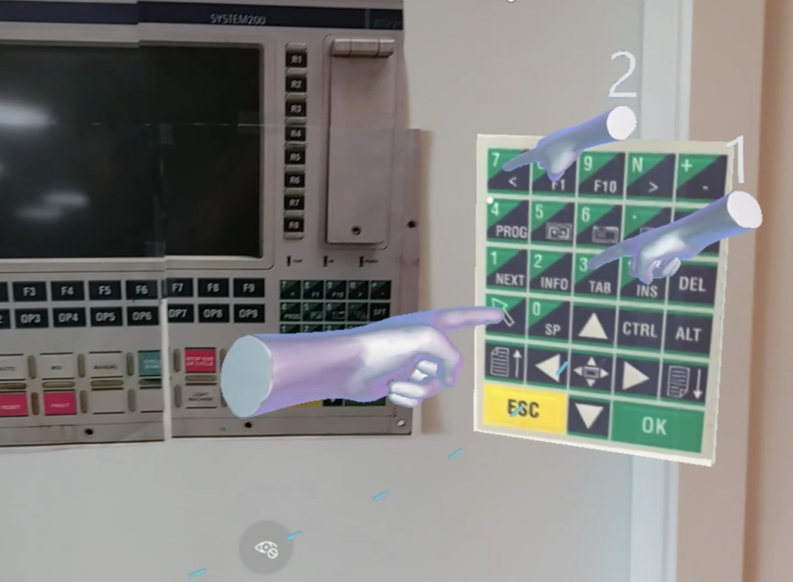

# Tips for pointing at small, closely spaced objects in Dynamics 365 Guides

If you're working with small, closely spaced objects in Microsoft Dynamics 365 Guides, you might experience problems when trying to point at those objects due to HoloLens accuracy thresholds. For example, the following graphic shows a machine that has buttons that are placed very close together.

If you add 3D objects to point at the buttons in this case, it may be hard for the operator to interpret the holographic clutter, as shown in the following graphic.

This article provides tips for working with these types of objects.

## Creating an 3D image of an object

Creating a 3D image of an object (a machine, for example) or part of an object offers the following advantages over attaching holograms directly to original physical object:

- When you attach 3D pointers to an image, the pointers always stay in the exact same position relative to the image, so they're very precise.     

- You can place the image very close to the original object (close to where the operator needs to do the work). This saves the operator from having to continually refer back to the instruction card. 

    

- You can focus on just the part of the machine where the operator needs to focus. For example, in the following graphic the number pad has been isolated from the larger machine to help the operator focus.

    

- You can make the image larger (using the scaling feature in Dynamics 365 Guides to provide the effect of zooming in on the focus area. This makes it easier for the operator to see and understand.
    
    

- An image can convey what the operator needs to do faster than the written words in an instruction card. 

    

Using a 3D image this way is very efficient. You can create the 3D image very quickly (in 3D paint, for example) and then reuse the image for different steps in your guide, adding different 3D objects from the 3D toolkit, depending on what's required for the step.  
