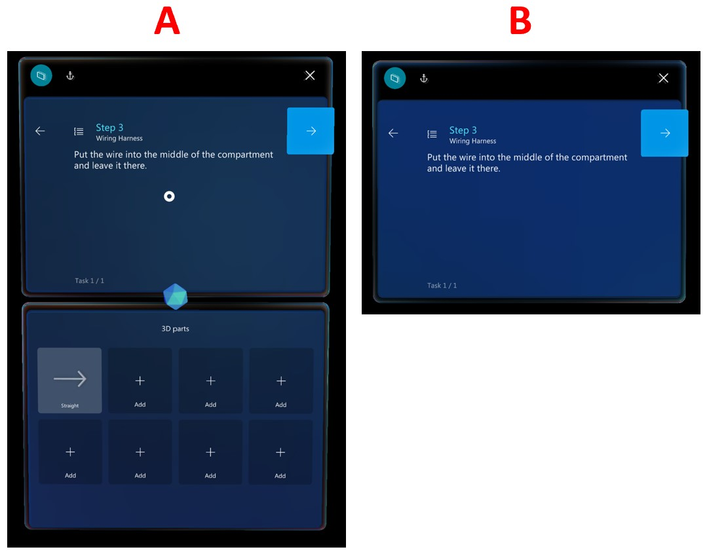

# Overview of the Step Editor in the Dynamics 365 Guides PC app

[!include [rename-banner](~/includes/cc-data-platform-banner.md)]

Steps are the central building block for creating a guide in [!include[cc-microsoft](../includes/cc-microsoft.md)] [!include[pn-dyn-365-guides](../includes/pn-dyn-365-guides.md)]. After you create the [structure for your guide in the **Outline** page](structure-guide.md), you use the Step Editor to add instructional text and 3D models or media to support those steps. The instructions that you create in the what-you-see-is-what-you-get (WYSIWYG) Step Editor match what the operator sees in the Step card on [!include[pn-hololens](../includes/pn-hololens.md)]. The following illustration shows the Step Editor in the PC app (A) and the Step card that the user sees on [!include[pn-hololens](../includes/pn-hololens.md)] (B).

## Open the Step Editor and add instructions

You open the **Step Editor** page from the **Outline** page.

1. Select any step in the **Outline** page, or select **Step** in the left navigation.

    

2. Enter your instructional text in the blue rectangle in the middle of the page.

    

3. When you're ready to add another step, select **Add step** in the upper-right corner of the page.

## What can you add to help operators with a step?

You can add 3D content, media, or website links to help operators complete a step. The following table describes the different types of content that you can add.

| Content type | Description | Example |
|---|---|---|
| [3D models from the 3D toolkit](pc-app-add-3D-model.md) | Ready-to-use 3D models, such as numbers, arrows, and hands | A holographic arrow that helps operators find a focus area |
| [3D part](pc-app-add-3D-part.md) | 3D models that are specific to your company | A 3D part hologram that helps operators find a 3D part in the real world |
| [Image](pc-app-add-media.md) | A 2D image file | A diagram that helps operators complete a complex step |
| [Video](pc-app-add-media.md) | A video file | A short video that helps operators complete a complex step |
| [Website link](pc-app-website-powerapps-link.md) | A link to an external website | A link to a parts inventory system |
| [Power Apps link](pc-app-website-powerapps-link.md) | A link to an app created in Power Apps | A link to an interactive quiz app or a parts re-ordering app|

## Go to other pages from the Step Editor page

Use the buttons in the navigation pane on the left side of the **Step Editor** page to go to other pages in the PC app. The following table describes the buttons in the navigation pane.

| Button | Name | Action |
|---|---|---|
|  | Open Navigation | Expand the navigation pane so that it includes a description for each button. |
|  | Home | Go to the **Welcome** page, where you can create a new guide or open an existing guide. |
|  | Analyze | Go to the **Analyze** page, where you can set up Microsoft Power BI reports (Guides Analytics) to analyze your guides. |
| | Anchor | Open the **Choose an anchor method** wizard, where you can select different anchor methods for your guide or change the type of anchoring method. |
| | Outline | Go to the **Outline** page, where you can structure or restructure your guide. You can also open the **Choose an anchor method** wizard from that page. |

## Best practices for instructional text and supporting content

- Don't be afraid to add lots of steps, but keep the text short. Instruction text is limited to 280 characters per step.

- For the best results, write your guide in casual human language. Avoid technical jargon.

- Use descriptive words, such as *locate*, *find*, *get*, *go to*, *pick up*, *put down*, *insert*, *attach*, and *remove*.

- **NOTE** steps are useful for quality checks. This type of step can come before or after another step. Just be sure to add it in the right place.

- Add a **WARNING** step for things that could be dangerous or cause a quality issue. To reinforce the warning, you can [add a style in the HoloLens app](hololens-app-orientation.md#add-styles-for-emphasis).

- Sub-steps inside a step can be helpful, but don't be afraid to create separate steps for easier reading.

- When you've finished writing a step, be sure to move the cursor outside the text box to activate AutoSave.

- Try to limit yourself to one type of content per step. Too much media or 3D content can overwhelm the operator and can be too time-consuming to absorb. Think about the type of content that best gets the point across.

## What's next?

- [Add a 3D model from the 3D toolkit](pc-app-add-3D-model.md)
- [Add a 3D part](pc-app-add-3D-part.md)
- [Add an image or video file](pc-app-add-media.md)
- [Add a website or Power Apps link](pc-app-website-powerapps-link.md)
- [How to make a great mixed-reality guide](great-guide.md)

[!INCLUDE[footer-include](../includes/footer-banner.md)]
