# Use voice commands in Dynamics 365 Guides as a substitute for hand gestures or gaze

You can use voice commands in Microsoft Dynamics 365 Guides as a substitute for touch or gaze. Voice commands save you time and keep you in the flow of your work, because you don't have to gaze at buttons or touch them to take actions.

For increased accuracy, most voice commands are contextual. In other words, they work only when the appropriate page is open.

> [!NOTE]
> Voice commands work best on HoloLens 2. Although you can use voice commands on HoloLens 1, HoloLens 1 isn't optimized for voice in loud environments.

## Prerequisites

- Speech must be enabled on the device.

- You must give Dynamics 365 Guides permission to use your microphone during the first run of the app. Alternatively, go to **Settings** \> **Privacy** \> **Microphone**, and set the **Dynamics 365 Guides** option to **On**.

    

> [!NOTE]
> Voice commands are supported for [all languages that Dynamics 365 Guides supports](./faq.md#what-languages-is-dynamics-365-guides-available-in). The language is based on the Windows display language, not the keyboard language. You can verify the Windows display language by going to **Settings** \> **Time and Language** \> **Language**.

## Use voice commands

The sections below show Dynamics 365 Guides pages and the voice commands that you can use for each of them.

> [!TIP]
> Regardless of where you are in the app, the [Select](/hololens/hololens-cortana#general-speech-commands) voice command works like an air tap.

## Sign-in page

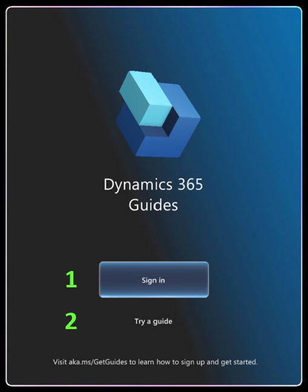

| Number in screenshot | Say this | To do this |
|---|---|---|
| 1 | "Sign in" | Start the sign-in process. |
| 2 | "Try a guide" | Open the Dynamics 365 Guides demo. |

## Instance selection page

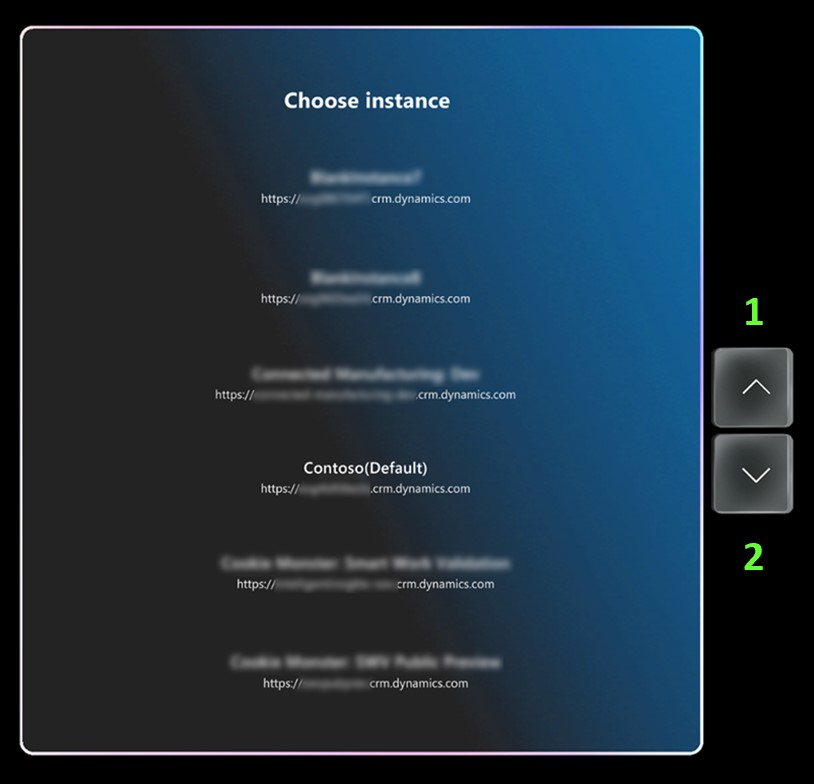

| Number in screenshot | Say this | To do this |
|---|---|---|
| 1 | "Scroll up" | Scroll up the list. |
| 2 | "Scroll down" | Scroll down the list. |

## Main menu

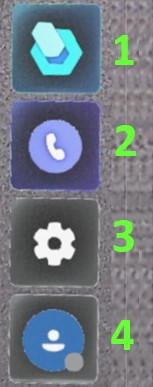

| Number in screenshot | Say this | To do this |
|---|---|---|
| Not shown | "Show Main menu" | Open the Main menu or bring it to you. |
| Not shown | "Hide Main menu" | Hide the Main menu. |
| 1 | "Show Work" | Open the Work activity to see your guides and folders. |
| 2 | "Show Call" | Open the Call activity to see your contacts. |
| 3 | "Show Settings" | Open the **Settings** page. |
| 4 | "Show Profile" | Open the **Profile** page. |

## Work activity

### Guides and folders list

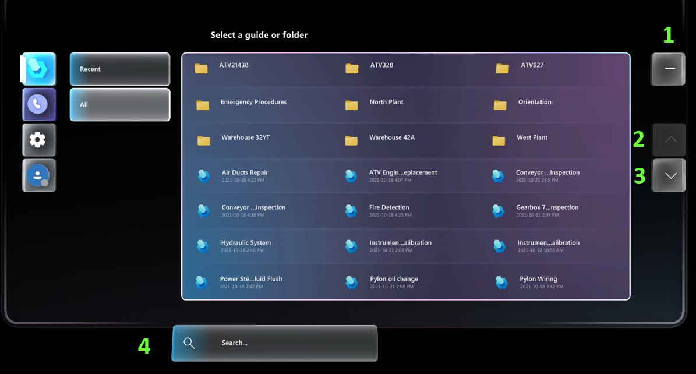

|Number in screenshot | Say this | To do this |
|---|---|---|
| 1 | "Minimize" | Hide the content panel and the Main menu. |
| 2 | "Scroll up" | Scroll the list up. |
| 3 | "Scroll down" | Scroll the list down. |
| 4 | "Start search" | Activate the search and open the keyboard. |
| 5 | "Clear search" | Delete the text in the Search box. |
| 6 | "Previous folder" | Go back to the previous folder. |

## Select mode screen

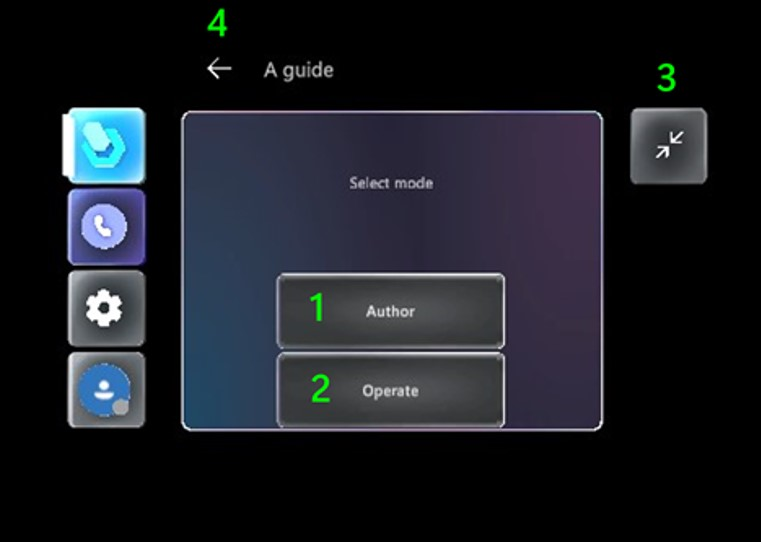

| Number in screenshot | Say this | To do this |
|---|---|---|
| 1 | "Author" | Select **Author** mode. |
| 2 | "Operate" | Select **Operate** mode. |
| 3 | "Minimize" | Hide the content panel and the Main menu. |
| 4 | "Go back" | Go back to the guides and folders list and cancel opening the current guide. |

## Align holographic anchor page

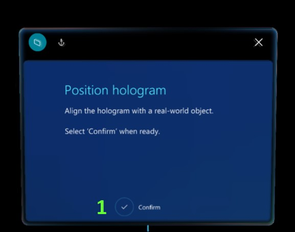

| Number in screenshot | Say this | To do this |
|---|---|---|
| 1 | "Confirm" | Confirm the position of the anchor so that you can start to use the guide. |

## Scan anchor page (QR code and circular code)

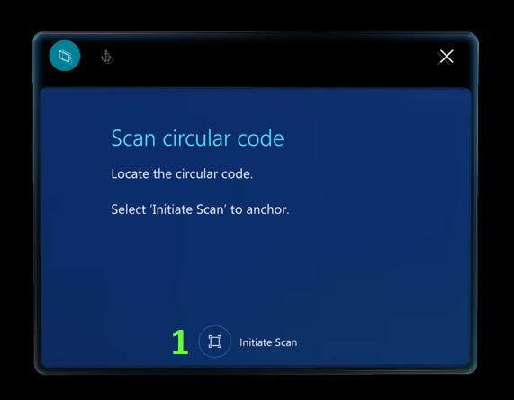

| Number in screenshot | Say this | To do this |
|---|---|---|
| 1 | "Initiate scan" | Start anchor scanning. |

## Anchor found page (QR code and circular code)

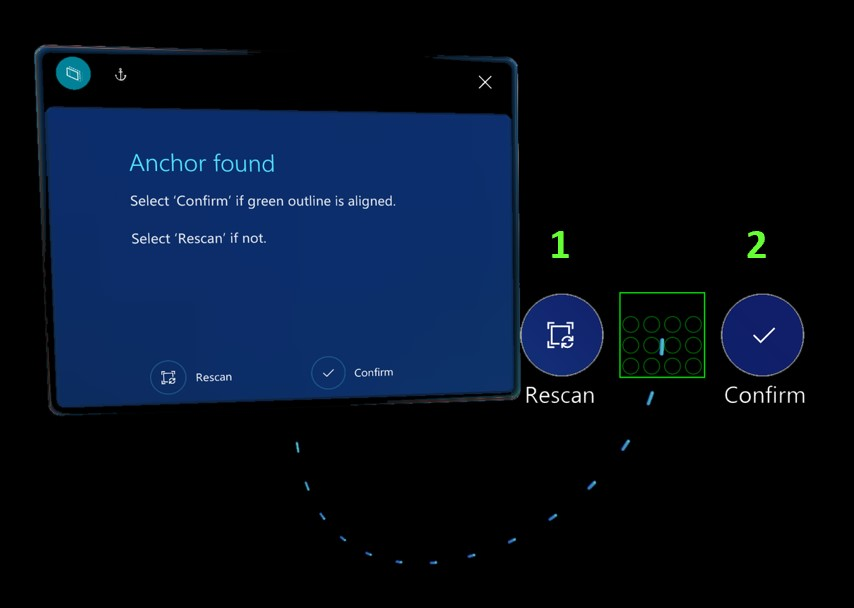

| Number in screenshot | Say this | To do this |
|---|---|---|
| 1 | "Rescan" | Rescan the anchor if holograms aren't correctly aligned. |
| 2 | "Confirm" | Confirm the position of the anchor so that you can start to use the guide. |

## Step card page

| Number in screenshot | Button or element | Say this | To do this |
|---|---|---|---|
| 1 | ") | "Follow me" | Turn on **Follow** mode, and bring the card to the center of the field of view. |
| 2 | ") | "Place here" | Turn off **Follow** mode, and bring the card to the center of the field of view. |
| 3 |  | "Go to anchor" | Go to the anchor step to re-anchor the guide. |
| 4 |  | "Go back" | Go to the previous step. |
| 5 |  | "Go to outline" | Go to the **Outline** view for the task or step. |
| 6 |  | "Next step" | Go to the next step. |
| 7 |  | "Hide holograms" | Turn off visibility for 3D parts (if 3D parts have been placed and they are visible). |
| 8 |  | "Show holograms" | Turn on visibility for 3D parts (if 3D parts have been placed but they are hidden). |
| 9 |  | "Play video" | Start the video that is attached to the step (if the step has a video). |
| 10 |  | "Pause video" | Pause the video. |
| 11 |  | "Restart guide" | Go to the first step in the guide.
**Note:** You must be on the Completion step to use this voice command.|
| 11 |  | "Exit guide" | Exit the current guide.
 |

## Outline list

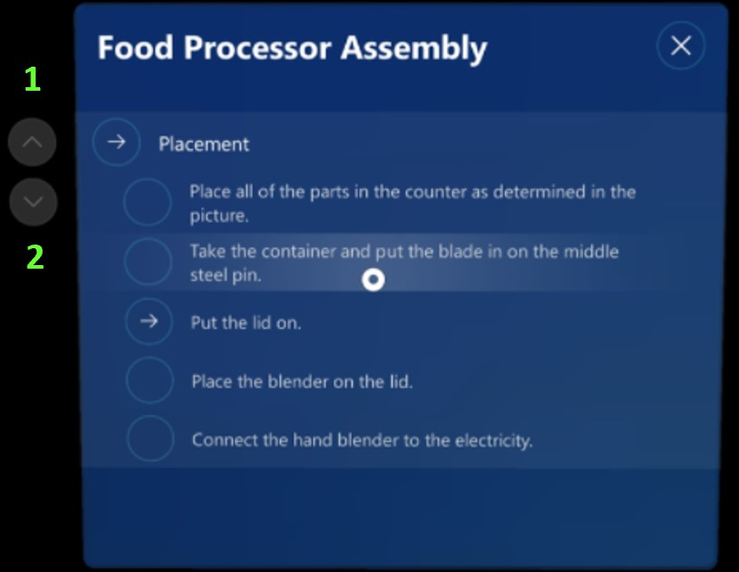

| Number in screenshot | Button or element | Say this | To do this |
|---|---|---|---|
| 1 |  | "Scroll up" | Scroll up the list. |
| 2 |  | "Scroll down" | Scroll down the list. |

## Author mode commands

| Button or element | Say this | To do this |
|---|---|---|
|  | "Undo changes" | Undo the last change. |
|  | "Redo changes" | Redo the last change. |
|  | "Save guide" | Save your most recent changes. |
|None|"Copy 3D position"|Copy the 3D position (position, orientation, and scale) of a hologram to use with another hologram.|
|None|"Paste 3D position"|Paste the 3D position (position, orientation, and scale) of a hologram onto another hologram.|

## Narration

You can use the built-in HoloLens Text-to-Speech system to have HoloLens read instructions out loud.

### Use voice commands to turn narration on or off or to select a response in a question card

Use the commands in the following table to turn narration on or off or to select a response in a question card.

|Voice command |Action| 
|----------------------------|-----------------------------------------------------------------|
|Narration on |Start narration for the current and subsequent steps.  If narration is already turned on when you say this voice command, the narrator will repeat the instructions for the current step.| 
|Narration off| Turn off narration for the current and subsequent steps. |
|Narrateo step| Narrate the current step.|
|Response *Number*| Select the response in a question card indicated by the specified *Number*. For example, say **Response 1** to go to the item labeled "Response 1". |
|Response *Number* Text| Select the response in a question card indicated by the label position for that response. For example, if the label for the first response has been changed by the author to "Beginner" instead of "Response 1", say **Response 1 Text** to select that response.|

## Call activity

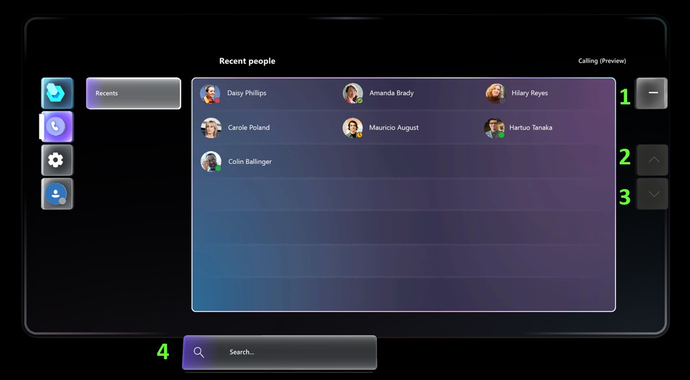

| Number in screenshot | Say this | To do this |
|---|---|---|
| 1 | "Minimize" | Minimize the Call activity screen and the Main menu. |
| 2 | "Scroll up" | Scroll up the list. |
| 3 | "Scroll down" | Scroll down the list. |
| 4 | "Start search" | Trigger search and open the keyboard. |
| Not shown | "Clear search" | Delete the search string currently in the search box. |

## Start a call

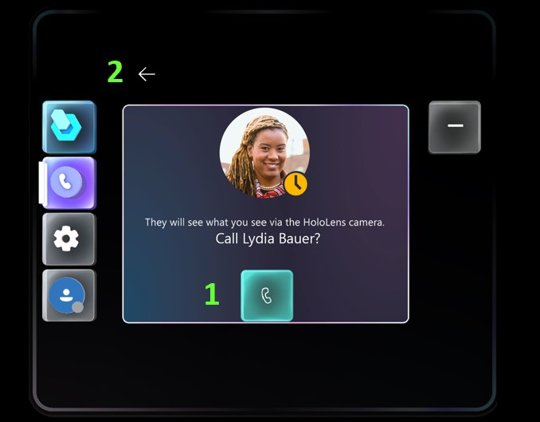

| Number in screenshot | Say this | To do this |
|---|---|---|
| 1 | "Call" | Call the selected contact. |
| 2| "Back" | Go back to the contact list and cancel the call. |

## Active call

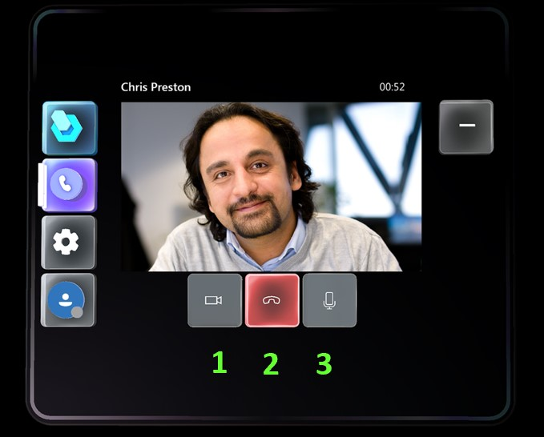

| Number in screenshot | Say this | To do this |
|---|---|---|
| 1| "Start video" or "Stop video" | Turn the video camera on or off. |
| 2| "End call" | Close the current call. |
| 3 | "Mute" or "Unmute" | Mute or unmute the microphone. |

## Settings

## Profile

| Number in screenshot | Say this | To do this |
|---|---|---|
| 1 | "Minimize" | Hide the content panel and the Main menu. |
| 2| "Sign out" | Sign out of Dynamics 365 Guides. |

## Dialog boxes

For dialog boxes, read the label of the button (for example, say "Yes" or "No"). 

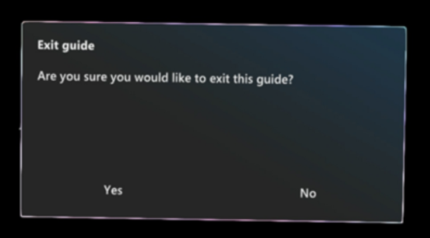

[!INCLUDE[footer-include](../includes/footer-banner.md)]
