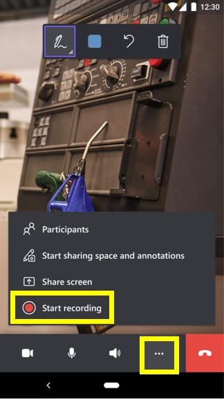
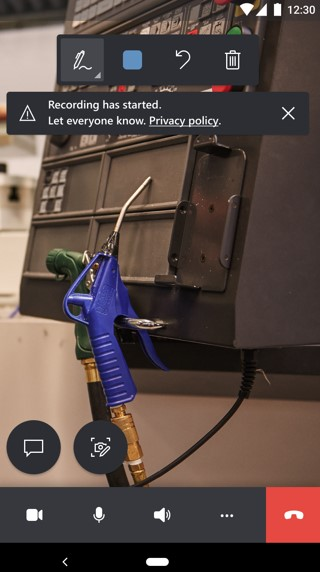

# Capture session history through call recording in Dynamics 365 Remote Assist mobile

Technicians can use call recording in Microsoft Dynamics 365 Remote Assist mobile to comprehensively document their video calls with remote collaborators. For businesses, it's important to keep a record of different incidents on a daily basis. Often, these records are kept through paper trails or text-based collateral. Operations managers, technicians, and business decision makers can use call recordings for:

- Reference for follow-up work
- Validation that the maintenance and repair process was completed correctly
- Training material

Call recording is only available for one-to-one or group calls in Dynamics 365 Remote Assist mobile. After the call recording ends, it's automatically uploaded to OneDrive for Business. After the recording is uploaded, all call participants can access it via their Dynamics 365 Remote Assist mobile call text chat or  Microsoft Teams chat. The Dynamics 365 Remote Assist mobile user who started the call recording can also see it in their OneDrive for Business folder.

The following chart explains which call participant can initiate a call recording in each type of call with a Dynamics 365 Remote Assist mobile user:

| Call type|Can a Dynamics 365 Remote Assist mobile user record?     |Can a Dynamics 365 Remote Assist HoloLens user record?     | Can a Teams desktop user record? |  Can a Teams mobile user record?  |  
|---|---|---|---|---|
|  One-to-one call |  Yes |  Yes |  Yes | Yes |
|  Group call |  Yes | Yes | Yes | N/A - calling scenario not currently supported |  

## How it works

1. The technician selects the **More** (ellipsis) button, and then selects **Start recording**.

    

2. The technician receives a privacy notification with Microsoft’s privacy policy and a notice that call recording has started. 

    

3. At all times during the call, the technician can see that the call recording is in progress by viewing the call-recording indicator in the upper-right corner of the text chat.

    

4. The technician can select the record button to stop the call recording at any point. After the call has ended, both call participants will receive a notification that the call recording will be available in OneDrive for Business. Once the call recording has been uploaded to OneDrive for Business, both participants can access it through the Dynamics 365 Remote Assist mobile call text chat, Microsoft Teams text chat, or from the OneDrive for Business folder.

[!INCLUDE[footer-include](../../includes/footer-banner.md)]
