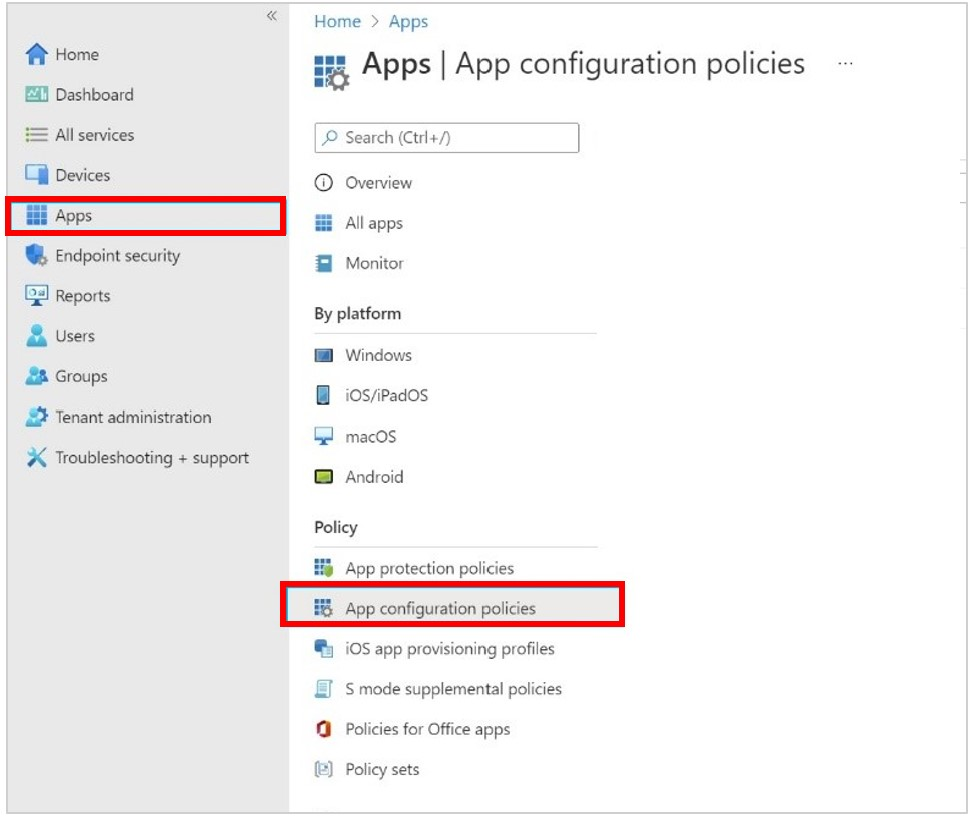
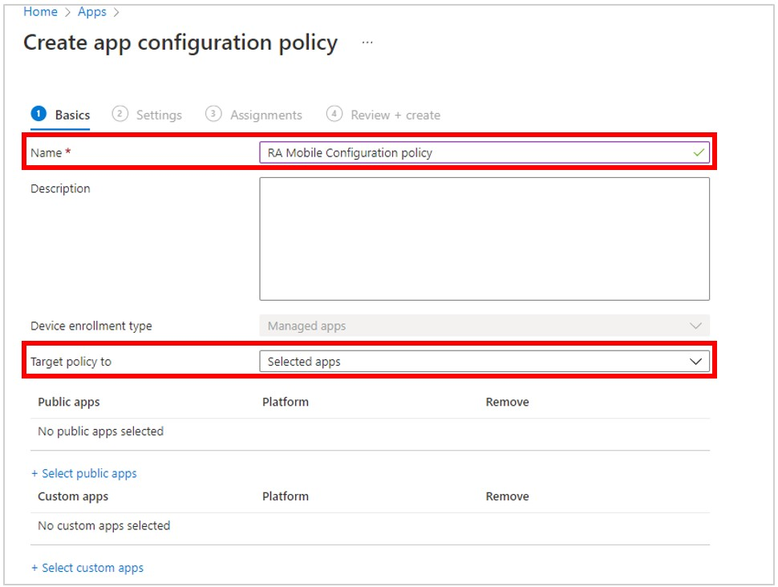
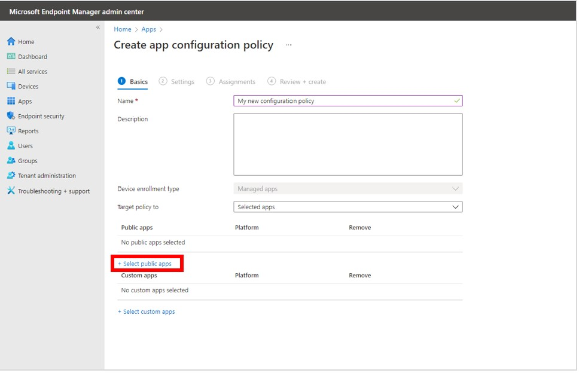
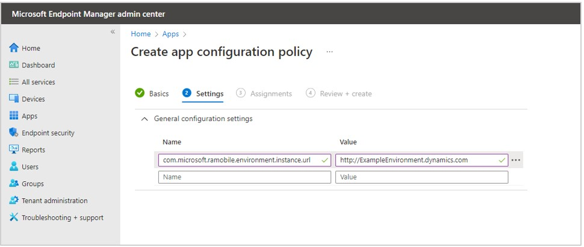
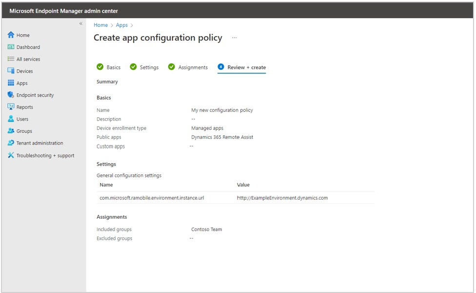

# Use Microsoft Intune to create an app configuration policy for Dynamics 365 Remote Assist

You must be an administrator to create app configuration policies.

> [!NOTE]
> At this time, you can't create app configuration policies for iOS devices.

1. Go to [Microsoft Endpoint Manager](https://endpoint.microsoft.com/). 

2. Select **Apps**, and then select **App configuration policies**. 

    

3. Select **Add**, and then select **Managed apps**. 

    

4. In the **Name** field, enter the name of the policy, and then in the **Target policy to** field, choose **Selected apps**.  

     
    
5. Under **Public apps**, choose **Select public apps**. 

    
    
7. On the right side of the screen, search for “Remote Assist”, select **Dynamics 365 Remote Assist Android**, and then choose the **Select** button. 

    
    
8. Select **Next** at the bottom of the screen. 

9. On the **Settings** tab, do the following:

    1. Set the **Name** field to "com.microsoft.ramobile.environment.instance.url". 

    2. In the **Value** field, enter the environment url. You can find this url in the [Power Platform admin center](https://admin.powerplatform.microsoft.com). Learn more: [Create and manage environments in the Power Platform admin center](https://docs.microsoft.com/power-platform/admin/create-environment)

    
    
9. Select **Next** at the bottom of the screen.

10. On the **Assignments** tab, under **Included groups**, select **Add groups**.

    

11. On the right side of the screen, select the correct group for your organization, and then select **Next** at the bottom of the screen.

       
       
12. On the **Review + create** tab, review the summary for the configuration policy, and then select **Create** to create the policy when you’re ready.

    
    
[Learn more about app configuration policies for Microsoft Intune](https://docs.microsoft.com/mem/intune/apps/app-configuration-policies-overview)
