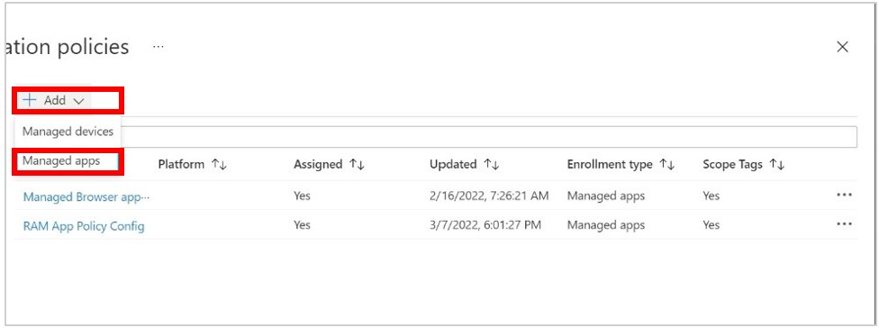
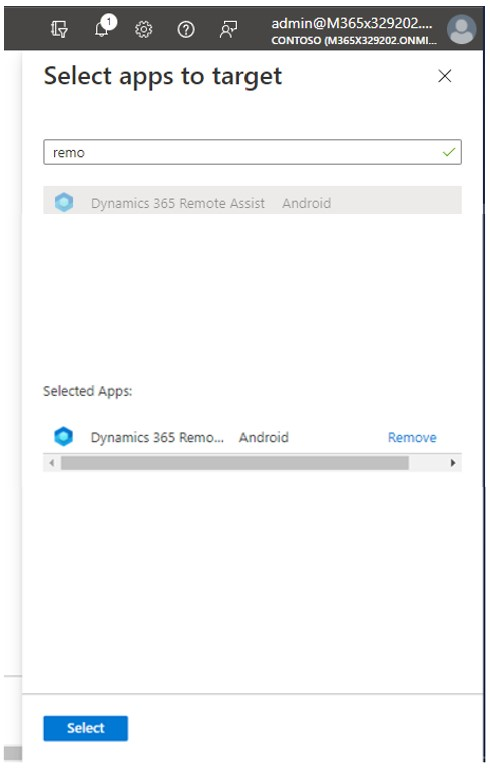
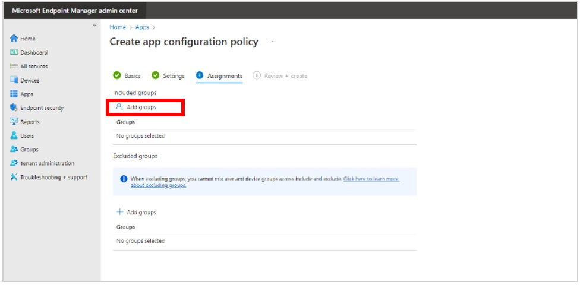
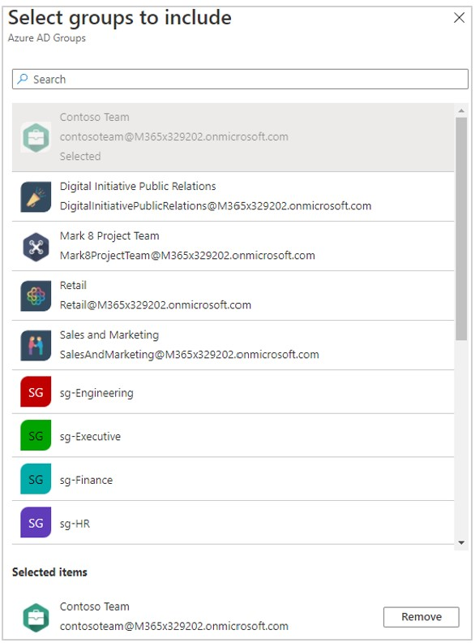

# Dynamics 365 Remote Assist mobile overview

Dynamics 365 Remote Assist enables technicians with mobile devices to connect to a remote collaborator on Dynamics 365 Remote Assist mobile or Microsoft Teams (desktop and mobile). Using live video calling, mixed-reality annotations, and high-resolution snapshots, they can share what they see with the remote collaborator to troubleshoot problems together, faster.

Dynamics 365 Remote Assist mobile is beneficial in scenarios where technicians may need physical access to confined or hard-to-reach spaces, or access to other mobile apps that are part of their organizations' workflows. With the availability and familiarity with mobile devices, technicians can use Dynamics 365 Remote Assist mobile during repairs and inspections with ease. Furthermore, Dynamics 365 Remote Assist mobile allows for easier broad-scale deployment in organizations.

Dynamics 365 Remote Assist is available on [Android phones and tablets with ARCore support](https://developers.google.com/ar/discover/supported-devices) and [iOS iPhones and iPads with ARKit support](https://developers.google.com/ar/discover/supported-devices#ios). Additionally, Dynamics 365 Remote Assist is available on mobile devices **without** ARCore or ARKit support, too! Visit our [documentation on product requirements](../requirements.md) to learn more.

## Features

- One-to-one and group video calling.
- Add mixed reality annotations in space.
- Use asset capture in offline scenarios so that users can annotate, capture, and visualize images and videos of assets and store them in Common Data Service. 
- Annotate on a 2D image capture, or snapshot, of the space during a call.
- Send and receive messages, in-call snapshots, and files through the text chat.
- Capture session history through call recordings.
- Annotate and share in-call snapshots in low-bandwidth scenarios.
- Integration with Microsoft Dynamics 365 for Field Service.
- Ability to link call history, in-call snapshots, and files shared during a Dynamics 365 Remote Assist mobile call to an associated Dynamics 365 Field Service work order.
- Ability to start a call to a remote collaborator from the Dynamics 365 Field Service mobile app to the Dynamics 365 Remote Assist mobile app.
- Availability on mobile devices without augmented reality (AR) support.

## Microsoft Intune support

Dynamics 365 Remote Assist mobile for iOS and Android supports Microsoft Intune's app protection policies. These policies ensure that data remains safe and contained on the device through Intune policies.  

### Create an app configuration policy for Android devices

You must be an administrator to create app configuration policies.

> [!NOTE]
> At this time, you can't set up configuration policies for iOS devices.

1. Go to [Microsoft Endpoint Manager](https://endpoint.microsoft.com/). 

2. Select **Apps**, and then select **App configuration policies**. 

    

3. Select **Add**, and then select **Managed apps**. 

    

4. In the **Name** field, enter the name of the policy, and then in the **Target policy to** field, choose **Selected apps**.  

     
    
5. Under **Public apps**, choose **Select public apps**. 

    
    
7. On the right side of the screen, search for “Remote Assist”, select **Dynamics 365 Remote Assist Android**, and then choose the **Select** button. 

    
    
8. Select **Next** at the bottom of the screen. 

9. On the **Settings** tab, do the following:

    1. Set the **Name** field to "com.microsoft.ramobile.environment.instance.url". 

    2. In the **Value** field, enter the environment url. You can find this url in the [Power Platform admin center](https://admin.powerplatform.microsoft.com). Learn more: [Create and manage environments in the Power Platform admin center](https://docs.microsoft.com/power-platform/admin/create-environment)

    
    
9. Select **Next** at the bottom of the screen.

10. On the **Assignments** tab, under **Included groups**, select **Add groups**.

    

11. On the right side of the screen, select the correct group for your organization, and then select **Next** at the bottom of the screen.

       
       
12. On the **Review + create** tab, review the summary for the configuration policy, and then select **Create** to create the configuration policy when you’re ready.

    
    
For more information about Microsoft Intune's app configuration policies, see [App configuration policies for Microsoft Intune](https://docs.microsoft.com/mem/intune/apps/app-configuration-policies-overview). 

## Videos

- [Watch a video on a technician using Dynamics 365 Remote Assist mobile on-site](https://www.youtube.com/watch?v=J-C6GE2gFYw&t=27s).
- [Watch a live demo of Dynamics 365 Remote Assist mobile in action, from signing in to ending the call](https://www.youtube.com/watch?v=DQJWsCDNpb4&t=1s).

## See also

- [Try Dynamics 365 Remote Assist mobile for free](../try-remote-assist.md).
- [Buy Dynamics 365 Remote Assist licenses](../buy-remote-assist.md).
- [Deploy Dynamics 365 Remote Assist to your workers' devices](../deploy-remote-assist.md).
- [How-to videos for using Dynamics 365 Remote Assist on mobile](../videos.md).
- [Dynamics 365 Remote Assist mobile - FAQs](/dynamics365/mixed-reality/remote-assist/faq#using-remote-assist-on-mobile).

[!INCLUDE[footer-include](../../includes/footer-banner.md)]
