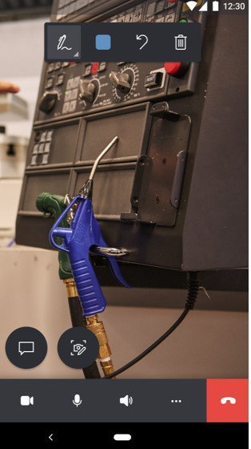
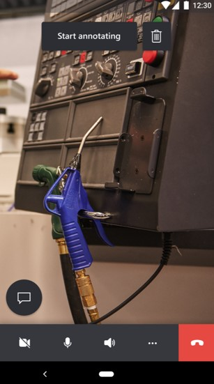
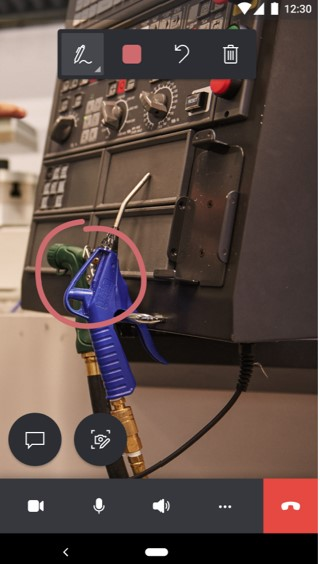
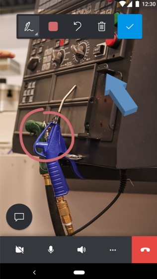
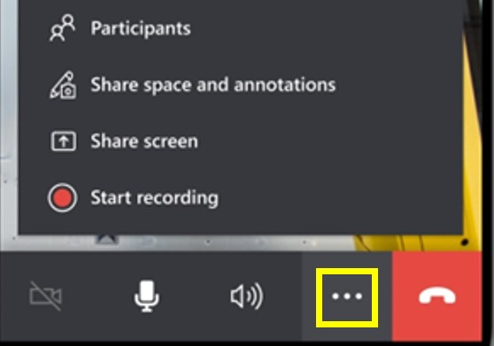

# Call another Dynamics 365 Remote Assist mobile user from Dynamics 365 Remote Assist mobile

Technicians using Microsoft Dynamics 365 Remote Assist mobile can call and collaborate with their peers who are also using Dynamics 365 Remote Assist mobile. This article shows how to do one-to-one calls. See the following articles for different mobile app scenarios:

- [Collaborate with colleagues on Microsoft Teams desktop or Teams mobile](remote-assist-mobile-to-teams-calls.md)
- [Participate in group calls](group-calling.md)

## Prerequisites

- Call receivers must **not** have the Microsoft Teams application on their mobile devices. 

- Technicians must have a Dynamics 365 Remote Assist [free trial](../try-remote-assist.md) or [subscription](../buy-remote-assist.md).

- Remote collaborators must have a Dynamics 365 Remote Assist free trial or subscription and a Microsoft Teams [free trial or subscription](https://www.microsoft.com/microsoft-365/microsoft-teams/group-chat-software). Learn how to set up Dynamics 365 Remote Assist with [Teams desktop](../teams-pc-all.md) and [Teams mobile](../teams-mobile-all.md).

## How it works

1. Launch and sign in to Dynamics 365 Remote Assist on your iOS or Android phone or tablet.

2. Search for the remote collaborator's name.

    

3. Select the remote collaborator's name, and then select **Launch Call**.

   > [!NOTE]
   > If the remote collaborator is receiving the call on a mobile device with both Dynamics 365 Remote Assist mobile and Teams mobile installed, the remote collaborator can only answer on Teams mobile. 

    

4. If the remote collaborator answers the call on **Remote Assist mobile**, the technician's live video feed is shared to the remote collaborator's device screen.

     |Technician|Remote collaborator|
     |------------------------------------------------|------------------------------------------------|
     |||    

5. If the remote collaborator wants to share their own environment, the remote collaborator can select the **More** button, and then select **Start sharing**.

    

6. When the remote collaborator starts sharing their space, the technician can view the remote collaborator's space by selecting **Switch view**.

    

7. Either call participant can place annotations directly in the shared environment (their own environment) or by selecting **Start annotating**. 

    > [!NOTE] 
    > After the remote collaborator selects **Start annotating**, they can add mixed-reality annotations on a frozen frame of the shared environment. When they select the **Check mark** button, the annotation appears in the technician's shared environment.

     |Technician|Remote collaborator|
     |------------------------------------------------|------------------------------------------------|
     |||  

8. The technician can use the call controls toolbar to change between a video call and audio-only call, mute or unmute their microphone, turn the speaker on or off, or end the call. 

    
    
    Selecting the **More** button from the call controls toolbar enables the technician to add participants, share their space and annotations, share their screen, or record the call.
    
    

9. During the call, participants can capture and annotate on snapshots, send messages, share files, and more.

## FAQ 

**If remote collaborators (call receivers) have both Dynamics 365 Remote Assist mobile and Teams mobile installed on their devices, can they answer the call on Dynamics 365 Remote Assist mobile?** 

If you receive an incoming call on a device with both Dynamics 365 Remote Assist and Teams mobile installed, the call will be received on Teams mobile. To receive the incoming call notification on Dynamics 365 Remote Assist mobile, Teams mobile must not be installed on your device.

> [!NOTE] 
> When a Dynamics 365 Remote Assist mobile calls a remote collaborator and the remote collaborator answers on Teams mobile, the remote collaborator will have the same capabilities as they would if they answered on Dynamics 365 Remote Assist mobile, except that the remote collaborator cannot share their space.

[!INCLUDE[footer-include](../../includes/footer-banner.md)]
