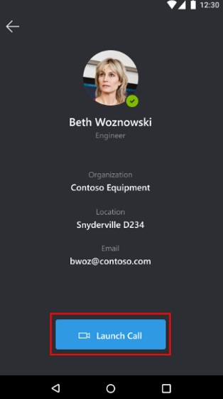
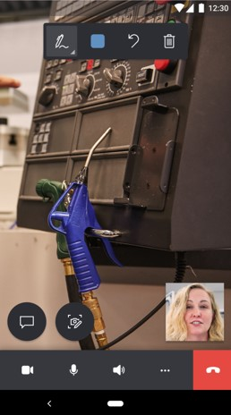
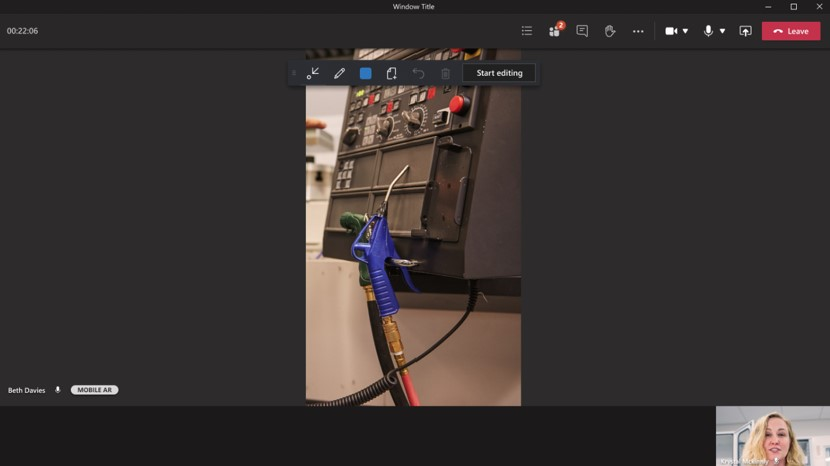
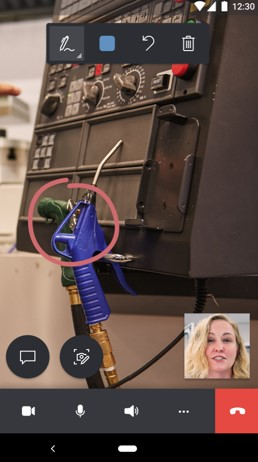
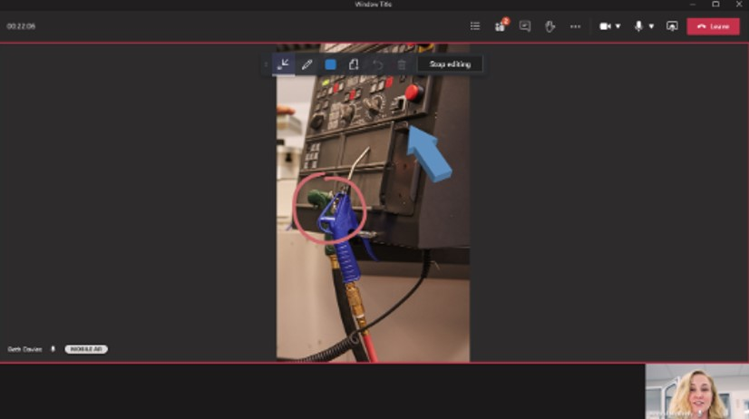
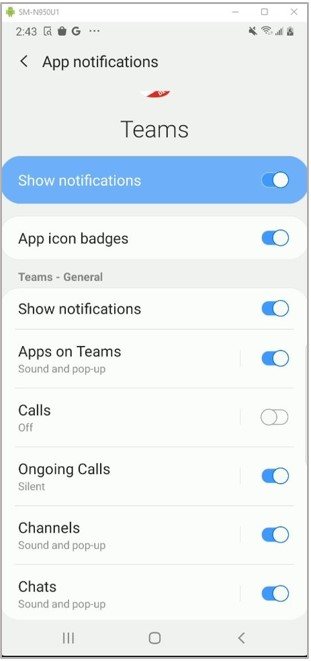

# Make calls between Dynamics 365 Remote Assist mobile and Microsoft Teams

Technicians using Dynamics 365 Remote Assist mobile can diagnose and resolve issues with remote specialists or collaborators using Microsoft Teams desktop or the Teams mobile app. Both call participants can place mixed-reality annotations in each other's space to collaborate effectively. 

> [!NOTE]
> This article shows how to make a one-to-one call between a Dynamics 365 Remote Assist mobile user and a Teams desktop or mobile user. [Learn about group calls with at least two Teams users](group-calling.md).

## Prerequisites

- Technicians must have a [Dynamics 365 Remote Assist free trial](../try-remote-assist.md) or a [Dynamics 365 Remote Assist subscription](../buy-remote-assist.md).

- Remote collaborators must have a Dynamics 365 Remote Assist free trial or subscription and/or [Microsoft Teams free trial or subscription](https://www.microsoft.com/microsoft-365/microsoft-teams/group-chat-software). [Learn how to set up Dynamics 365 Remote Assist with Teams desktop](../teams-pc-all.md) or [Teams mobile](../teams-mobile-all.md).

## How it works

1. Launch and sign into Dynamics 365 Remote Assist on an iOS or Android phone or tablet.

    > [!IMPORTANT]
    > The mixed-reality toolbar will not appear if the Dynamics 365 Remote Assist user joins the call from two different devices.

2. Search for the remote collaborator's name.

    

3. Select the remote collaborator's name, and then select **Launch Call**.

    
    
     > [!NOTE]
    > If Dynamics 365 Remote Assist Mobile and Teams mobile are both installed on the same device, [learn where incoming call notifications are received](remote-assist-mobile-to-teams-calls.md#What-happens-when-Dynamics-365-Remote-Assist-mobile-and-Teams-mobile-are-installed-on-the-same-device).

4. If the remote collaborator answers the call on **Teams desktop or mobile**, the technician's live video feed is shared with the remote collaborator's device screen.

    |Technician|Remote collaborator|
    |----------------------------------|--------------------------------------------------------------------|
    |||    

5. Either call participant can place annotations in the shared environment. The mobile app participant places the annotation in their own environment. The Teams desktop participant selects **Start editing**, and then places the annotation. 

    > [!NOTE] 
    > After the remote collaborator selects **Start editing**, the remote collaborator can add mixed-reality annotations on a frozen frame of the shared environment. When the remote collaborator selects **Stop editing**, the annotation appears in the technician's shared environment. 

   |Technician|Remote collaborator|
   |----------------------------------|--------------------------------------------------------------------|
   ||| 

6. The technician can use the call controls toolbar to change between a video call and audio-only call, mute or unmute their microphone, turn the speaker on or off, or end the call. 

    
    
    Selecting the **More** button from the call controls toolbar enables the technician to add participants, share their space and annotations, share their screen, or record the call.
    
    

7. During the call, participants can capture and annotate on snapshots, send messages, share files, and more.

## What happens when Dynamics 365 Remote Assist mobile and Teams mobile are installed on the same device

### iOS

If the remote collaborator receives the call on a mobile device with both Dynamics 365 Remote Assist mobile and Teams mobile installed, the remote collaborator will get incoming call notifications only on Teams mobile. 

### Android

If the remote collaborator receives the call on a mobile device with both Dynamics 365 Remote Assist mobile and Teams mobile installed, the remote collaborator will get incoming call notifications: 

- Only on Teams mobile if Teams mobile incoming call notifications are enabled in the **Settings** page.
 
- Only on Remote Assist mobile, if Teams mobile incoming call notifications are disabled in the **Settings** page. 

    

[!INCLUDE[footer-include](../../includes/footer-banner.md)]
