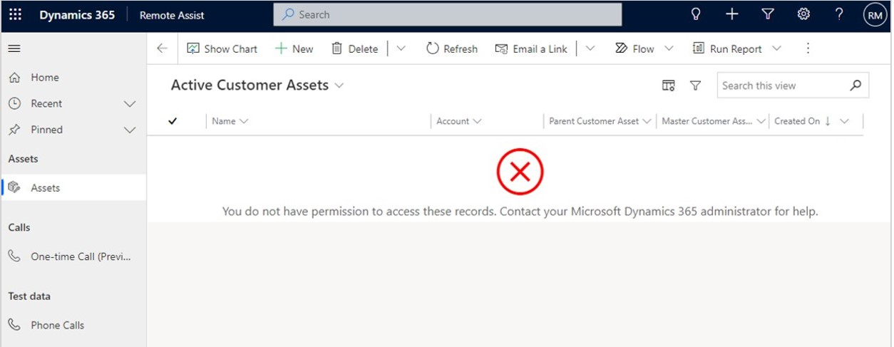
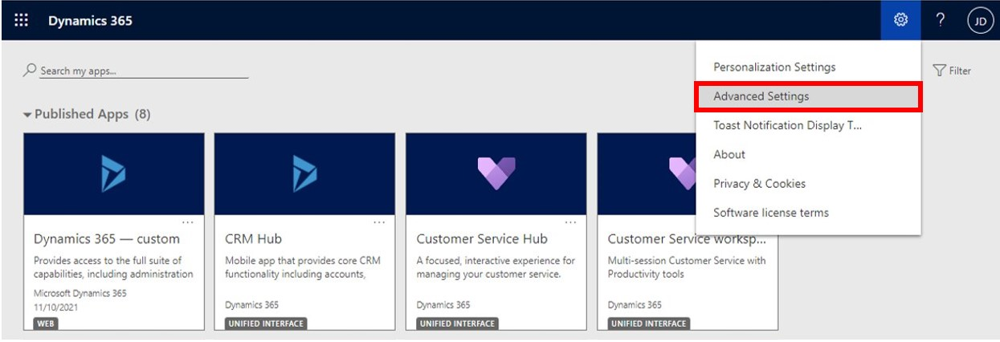
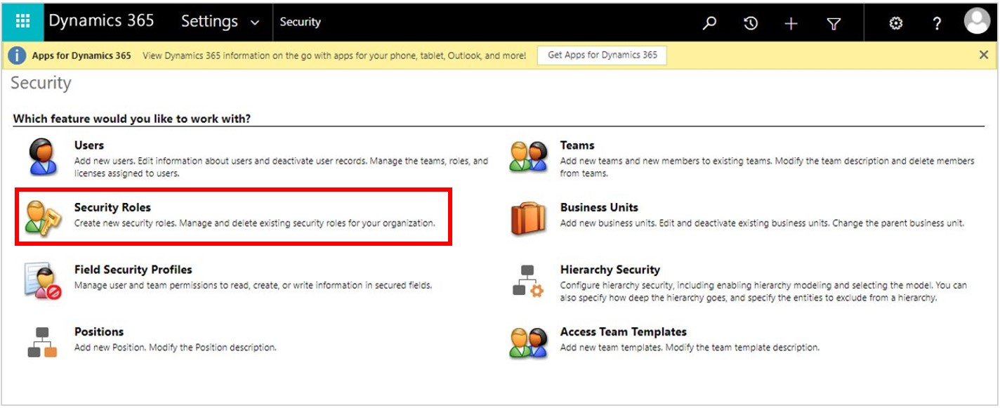
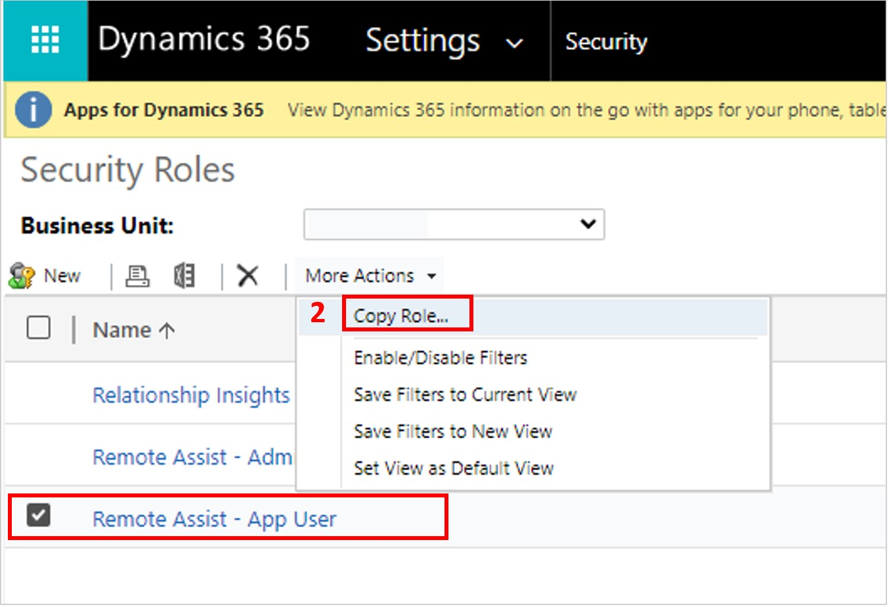
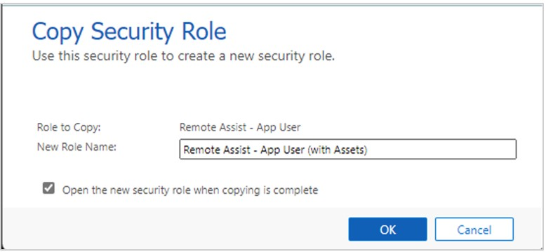
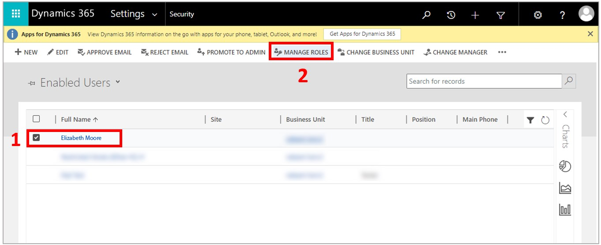

# Restrict the ability to access asset records in Dynamics 365 Remote Assist

If you [have a scenario where you need to protect your company information](restricted-mode-overview.md), you can restrict the ability for Microsoft Dynamics 365 Remote Assist users on HoloLens from [accessing asset records](asset-capture-overview.md). If you don't restrict the ability to access asset records, by default, HoloLens users will be able to access them. 

When you restrict the ability to access asset records this way, if a user selects the **Assets** tab in the Remote Assist model-driven app, they'll see the following message.

 

On HoloLens, users will see a message that lets them know they don't have the appropriate permissions. 

## Restrict the ability to access asset records

To restrict the ability to access asset records, you'll make a copy of the default role, and then remove the ability to access assets from that role. You can use the copy of the default role that retains the ability to access asset records if users need that ability. Note that you must assign this role for each user in each environment if you want them to be able to access asset records. 

1. Sign into the environment that has the asset records you want to protect, select the **Settings** button, and then select **Advanced Settings**.

    

2. In the Dynamics 365 window, select the down arrow next to **Settings**, and then select **Security**.

     

3. Select **Security Roles**.

     

4. Find and select the **Remote Assist - App User** role, select the down arrow next to **More Actions**, and then select **Copy Role**.

     
    
    > [!NOTE]
    > This is the role that will retain the ability to access asset records.

5. Add a descriptive name for the new role (for example "Remote Assist - App User (with Assets)", and then select **OK**.

     

6. Select the **Remote Assist - App User** default role so you can edit it. 

     

7. Select the **Custom Entities** tab, and then disable access for all scopes (Read, Write, and so on) for the following entities:

    - Customer Asset
    - Customer Asset Attachment
    - Customer Asset Category

     

8. Go back to **Settings > Security**, and then select **Users**.

     

9. Find and select the desired user, and then select **Manage Roles**.

     

10. Make sure the **Remote Assist - App User** role is selected.

     

11. Make sure that the following roles are not selected:

    - Remote Assist - App User (with Assets)
    - Remote Assist - Administrator
    - Field Service - Administrator
    - Field Service - Dispatcher
    - Field Service - Resource

     

    > [!NOTE]
    > Because the default role does not have access to assets, if there are any users that you DO want to have access to assets, you must assign them the **Remote Assist – App User (with Assets)** role. You must do this for each user across each environment.

    

NOTE- Verify that the user can access the desired resources and can’t access assets before handing the account to the end user.
