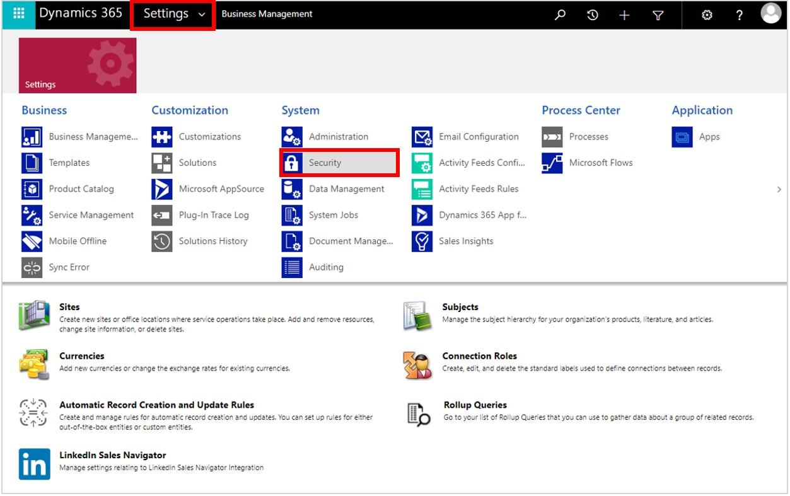
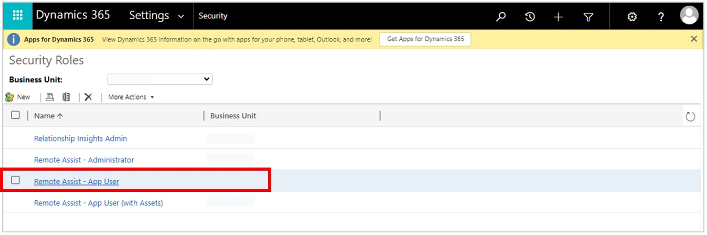
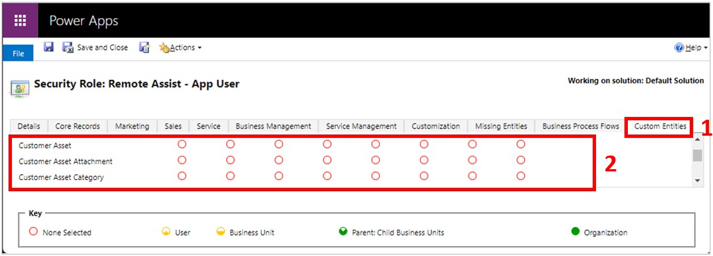
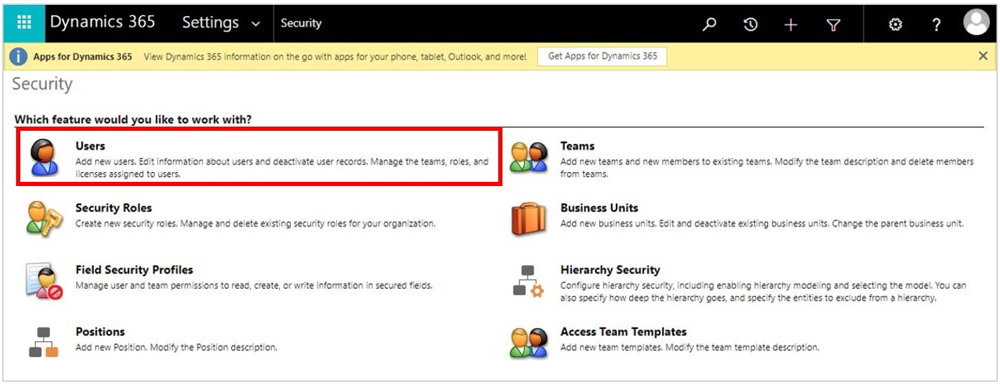
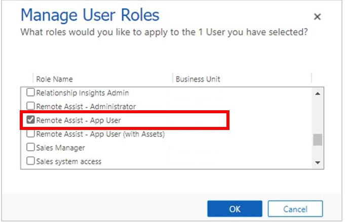
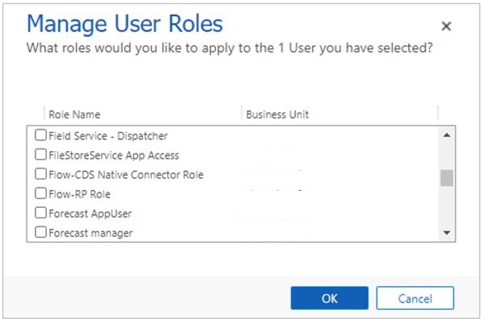

# Restrict the ability to access asset records in Dynamics 365 Remote Assist

[!INCLUDE[private-preview](../includes/private-preview.md)]

If you [have a scenario where you need to protect your company information](restricted-mode-overview.md), you can restrict the ability for Microsoft Dynamics 365 Remote Assist users on HoloLens from [accessing asset records](asset-capture-overview.md). If you don't restrict the ability to access asset records, by default, HoloLens users will be able to access them. 

When you restrict the ability to access asset records, users of the Remote Assist model-driven app, and users of the HoloLens and mobile app will see a message that says they don't have the appropriate permisssions to access asset records. 

## Restrict the ability to access asset records

To restrict the ability to access asset records, first make a copy of the default role, and then remove the ability to access assets from the default role. The copied role retains the permissions for accessing asset records. You can assign this copied role to users that **DO** need to be able to access asset records. You'll need to do this for each each environment that the user has access to. 

### Make a copy of the default role

1. Sign into the environment that has the asset records that you want to protect, select the **Settings** button, and then select **Advanced Settings**.

    

2. In the Dynamics 365 window, select the down arrow next to **Settings**, and then select **Security**.

     

3. Select **Security Roles**.

     

4. Find and select the **Remote Assist - App User** role (the default role), select the down arrow next to **More Actions**, and then select **Copy Role**.

     
    
5. Add a descriptive name for the new role (for example, **Remote Assist - App User (with Assets)**), and then select **OK**.

     
     
### Edit the default role and assign it

Next, you'll remove permissions to access asset records from the default role, and then assign it to the appropriate users.  

1. Select the **Remote Assist - App User** default role. 

     

2. Select the **Custom Entities** tab, and then disable access for all scopes (Read, Write, and so on) for the following entities:

    - Customer Asset
    - Customer Asset Attachment
    - Customer Asset Category

     

3. Go back to **Settings > Security**, and then select **Users**.

     

4. Find and select the desired user, and then select **Manage Roles**.

     

5. In the **Manage User Roles** dialog box, make sure that the **Remote Assist - App User** role is selected.

     

6. In the **Manage User Roles** dialog box, make sure that the following roles are not selected:

    - Remote Assist - App User (with Assets). If you named the copied role something different, be sure to clear the check box for that role. 
    - Remote Assist - Administrator
    - Field Service - Administrator
    - Field Service - Dispatcher
    - Field Service - Resource

     

7. Verify that the user can access the desired resources and can’t access assets before making the account available to the end user.

## See also

- [Overview of restricting capabilities in Dynamics 365 Remote Assist](restricted-mode-overview.md)
- [Restrict calling and the ability to search and access contacts](restricted-mode-calling.md)
- [Restrict the ability to access OneDrive files](restricted-mode-files.md)
- [Restrict the ability to change user accounts](restricted-mode-signout.md)
